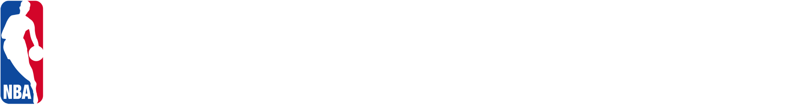

Ce dépôt GitHub contient tout le code nécessaire au bon fonctionnement du projet que nous avons nommé NBA SHOT PREDICTION.
Ce projet a été réalisé au cours de notre formation Data Scientist à Data Scientest.

## Vue d'ensemble du projet :

Ce projet a pour objectif rassembler les données de différents dataset afin d'exploirer les performances des 20 meilleurs joueurs de NBA et de développer un modèle de machine learning capable de prédire la réussite d'un tir d'un joueur.

Les principales étapes de notre projet comprennent :  
- l'exploration approfondie du jeu de données,
- la création d'une application streamlit pour visualiser les données  
- la préparation des données, 
- la conception et la mise en œuvre d'un modèle d'apprentissage, 
- l'analyse de ses performances.

Notre objectif final est de fournir les bases d’un outil robuste pour prédire un shot et analiser les principales caractéristiiques qui influent sur sa réusite.

## Jeux de donnée : 
Les données utilisées proviennent du site kaggle : 
- dataset des tirs NBA entre 1997 et 2019 : [kaggle](https://www.kaggle.com/jonathangmwl/nba-shot-locations)
- dataset des bilans d’équipe entre 2014 et 2018 : [kaggle](https://www.kaggle.com/nathanlauga/nba-games?select=ranking.csv)
- dataset des joueurs de NBA depuis 1950 : [kaggle](https://www.kaggle.com/drgilermo/nba-players-stats?select=Players.csv)

## Contributeur : 

- Didier ZEITOUN
- Samy SELLAM
- Yoann FAURE

sous la supervision de Frédéric FRANCINE 

Project Organization
------------

    ├── LICENSE
    ├── README.md          <- The top-level README for developers using this project.
    ├── data               <- Should be in your computer but not on Github (only in .gitignore)
    │   ├── preprocessed   <- Intermediate set of data produced manipulating raw data.
    │   ├── processed      <- The final, canonical data sets for modeling.
    |   ├── config         <- Some configuration data used for ETL, mapping, and filtering
    │   └── raw            <- The original, immutable data dump (in compressed form).
    │
    ├── models             <- Trained and serialized models, model predictions, or model summaries
    │
    ├── notebooks          <- Jupyter notebooks.
    │   └── data ETL
    │   └── data preprocessing
    │   └── model train
    │   └── model report
    │   └── model interpretability  
    │
    ├── reports            <- The reports that you'll make during this project as PDF
    │   └── figures        <- Generated graphics and figures to be used in reporting
    │
    ├── requirements.txt   <- The requirements file for reproducing the analysis environment, e.g.
    │                         generated with `pip freeze > requirements.txt`
    │


## Installation

Pour commencer à utiliser NBA SHOT PREDICTION, clonez le dépôt et installez les dépendances nécessaires :

    ```bash
    git clone https://github.com/DataScientest-Studio/SEP23_BDS_NBA.git NBA
    cd NBA
    pip install -r requirements.txt
    ```

Ensuite téléchargez le jeu de données de Kaggle cité plus haut et placez le dans votre dossier local data/raw.

## Utilisation

Pour lancer l'application Streamlit et interagir avec l'interface utilisateur :

```bash
streamlit run streamlit app/NBA.py 
```

ou consulter [la version en ligne ici](HTTP://nbadata.hd.free.FR:850)

Pour exécuter les notebooks de démonstration, ouvrez Jupyter Notebook et parcourez le répertoire notebooks/

--------

<p><small>Project based on the <a target="_blank" href="https://drivendata.github.io/cookiecutter-data-science/">cookiecutter data science project template</a>. #cookiecutterdatascience</small></p>
